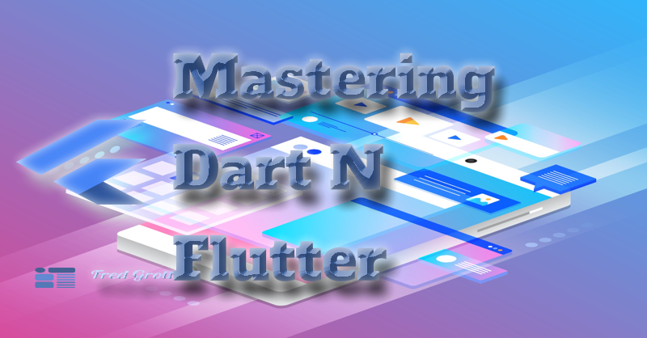

# Mastering Dart N Flutter

Dart and Flutter are cross-platform frameworks that work on:

Guide to Mastering Dart N Flutter (in process), basically resources to master Dart and Flutter plus the tools plus
development and design.

So why do this? Since I have found a nootropic way to treat my ADHD, I have found that as I review each subject that I have missed or misunderstood points. Thus, I am rebuilding my skills and knowledge in each area.

Yes, at later points these git repositories become code sources of books covering these subjects.

## Dart

[Master Dart]()

Covers the dart computer language features.

[Master Dart OOP]()

Covers Object-Oriented Programming structures in Dart.

[Master Dart FP]()

Covers Functional Programming structures in Dart.

[Master Dart Data Structures]()

Covers Data Structures in Dart.

## Flutter

[Master Flutter]()

Covers the major features of the Flutter framework.

[Master Flutter Adaptive](https://github.com/fredgrott/master_flutter_adaptive)

Covers how to implement the adaptive scaffold and canonical layout patterns for all device form factors including foldables.

[Master Flutter Testing]()

My opinionated way to do flutter testing, covering my own flutter testing stack of plugins and testing strategies.

[Master Flutter State Management]()

Flutter state management is switch from MVC to MVVM to simplify data binding, then wire up observers to Dart streaming. I cover some helpful plugins that automate the data binding and the observer auto-wiring.

[Master Flutter Themes]()

There are some 27-plus component themes in flutter. I cover a more power and easier way to auto-write those component themes based on configuring color scheme in more power manner.

[Master Flutter Navigation]()

I cover how to get type safe navigation routes without having to use build runner using Google's recommended Go Router package.

[Master Flutter Storage]()

I cover how to store data in flutter using hive and isar as they are NOSQL cross-platform solutions.

[Master Flutter Layout Widgets]()

Flutter layout is different from HTML-plus-CSS layouts in that constraints go down, sizes go up, and the parent sets position.
Covers in detail how that works for all the layout widgets in the Flutter framework.

[Master Flutter Web Design]()

Covers how to use flutter to create websites including how to insert meta SEO, etc.

## Tools

[Master VSCode]()

Covers the best IDE to use ever and how to set it up and customize it.

[Master Krita]()

Covers how to use Krita to create graphics, including bitmap and vector.

[Master Git]()

Covers the in-and-outs of using git.

[Master ASCII Doctor]()

Covers using ASCII Doctor to create slides and books.

## Design

[Master Color Theory]()

Covers color theory and color matching.

[Master Typography]()

Covers typography.

## Social

I publish a flutter newsletter at:

And my socials are:

## License

BSD-clause 3 license copyright by Fredrick Allan Grott 2024.